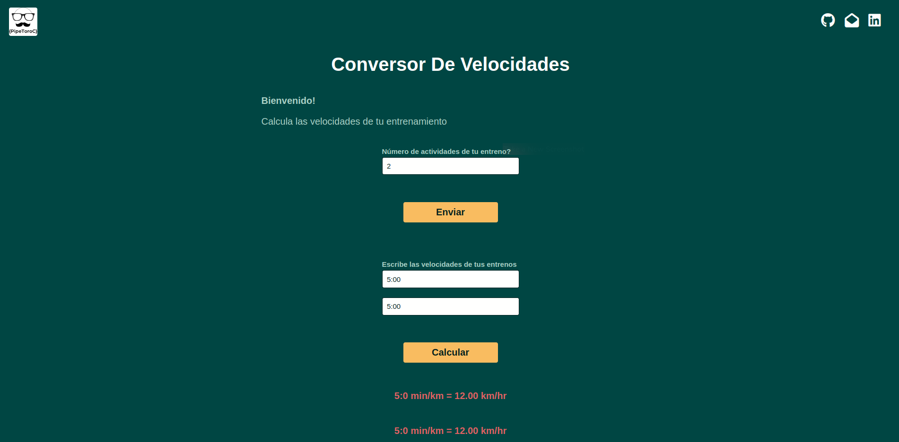

# runningCoversor
A small unit converter project that converts speeds from min/km to km/hr. I started running a couple of years ago and fell in love with it. Lately, I've been running on a treadmill that displays the speed in km/hr, but I didn't like the unit converters available online, so I created my own.

# Technologies
- javaScript
- HTML
- CSS

# License
- MIT

# Project URL
- You can check the clicking in [demo](https://pipetoroc.github.io/runningConversor/)

# Image
